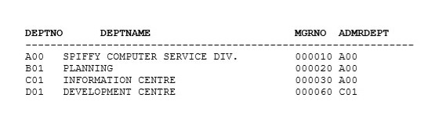

Lab sheet 2
Create and Query Object Relational Tables

1.

### INCOMPLETE TYPE

Since both objects are depending on each other we have to first create a one incomplete type

```
CREATE TYPE dept_t;
/
```

### CREATE TYPE OBJECT

Now we can create emp type object

```
CREATE TYPE emp_t AS OBJECT(
  empno CHAR(6),
  firstname VARCHAR(12),
  lastname VARCHAR(15),
  workdept REF dept_t,
  sex CHAR(1),
  birthday DATE,
  salary NUMBER(8,2)
);
/
```

Here now we are defining that incomplete object

```
CREATE TYPE dept_t AS OBJECT(
  deptno CHAR(3),
  deptname VARCHAR(36),
  mgrno REF emp_t,
  admrdept REF dept_t
);
/
```
Now we have created two types and lets create tables to store those types objects.

### CREATE TABLE

`ordept` table:



Ops! there is a problem, we cannot right away create both tables with foreign keys because of both tables depends on each other.
So, we can first create `oremp` and `ordept` table and `ALTER` `oremp` table and add `workdept` `FORIEGN KEY`.

Below is the easiest(not recommended) way without adding `constraint` with name:
```
CREATE TABLE oremp OF emp_t(empno PRIMARY KEY)
/
```

But I recommend you to use with named `constraint`s because latter on we have
power to change (drop, delete and etc) `contraint` as we want.

### CREATE TABLE / CONSTRAINT

So, here is the recommended way:
```
CREATE TABLE oremp OF emp_t(
    CONSTRAINT oremp_pk PRIMARY KEY(empno),
    CONSTRAINT oremp_fname_nn firstname NOT NULL,
    CONSTRAINT oremp_lname_nn lastname NOT NULL,
    CONSTRAINT oremp_sex_chk sex CHECK(sex='M' OR sex='F' OR sex='m' OR sex='f')
)
/
```

Let's right way use the recommended way to create `ordept` table:
```
CREATE TABLE ordept OF dept_t(
    CONSTRAINT ordept_pk PRIMARY KEY(deptno),
    CONSTRAINT ordept_depntname_nn deptname NOT NULL,
    CONSTRAINT ordept_mgrno_fk FOREIGN KEY(mgrno) REFERENCES oremp,
    CONSTRAINT ordept_admrdept_fk FOREIGN KEY(admrdept) REFERENCES ordept
)
/
```

### ALTER

Now we can `ALTER` the `oremp` table to add `workdept` since we have created the `ordept` table:
```
ALTER TABLE oremp
ADD CONSTRAINT oremp_fk FOREIGN KEY(workdept) REFERENCES ordept
/
```

**Bonus**

To get table / database information, can use:

`DESC table_name` or `DESC db_name`

To clear the screen, use:

`clear screen`

### INSERT

<h5>Now let's insert some values to `oremp` table:</h5>

We are going to insert values to `ordept` table because of `workdept` cannot
reference without inserting values to `ordept`. Then we can add to `oremp`.

Another thing to keep in mind that when we first insert values, we cannot add values
to `mgrno` and `admrdept`. But if you refer `ordept` table carefully.
You will notice that after we insert first object we can add values for `admrdept`.

*Let's see how to do this:*

```
INSERT INTO ordept VALUES (dept_t('A00', 'SPIFFY COMPUTER SERVICE DIV.', NULL, NULL))
/
```

Now, we can insert value for `admrdept` because of we have inserted first row/object
and that's the one we have to refer for the second row according to provided table.

```
INSERT INTO ordept VALUES (dept_t('B01', 'PLANNING', NULL, (SELECT ref(d) FROM ordept d WHERE d.deptno = 'A00')))
/
```

```
INSERT INTO ordept VALUES (dept_t('C01', 'INFORMATION CENTRE', NULL, (SELECT ref(d) FROM ordept d WHERE d.deptno = 'A00')))
/
```

```
INSERT INTO ordept VALUES (dept_t('D01', 'DEVELOPMENT CENTRE', NULL, (SELECT ref(d) FROM ordept d WHERE d.deptno = 'C01')))
/
```