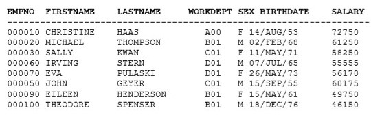

Lab sheet 2
Create and Query Object Relational Tables

1.

### INCOMPLETE TYPE

Since both objects are depending on each other we have to first create a one incomplete type

```
CREATE TYPE dept_t;
/
```

### CREATE TYPE OBJECT

Now we can create emp type object

```
CREATE TYPE emp_t AS OBJECT(
  empno CHAR(6),
  firstname VARCHAR(12),
  lastname VARCHAR(15),
  workdept REF dept_t,
  sex CHAR(1),
  birthday DATE,
  salary NUMBER(8,2)
);
/
```

Here now we are defining that incomplete object

```
CREATE TYPE dept_t AS OBJECT(
  deptno CHAR(3),
  deptname VARCHAR(36),
  mgrno REF emp_t,
  admrdept REF dept_t
);
/
```
Now we have created two types and lets create tables to store those types objects.

<hr />

### CREATE TABLE

`ordept` table:


Ops! there is a problem, we cannot right away create both tables with foreign keys because of both tables depends on each other.
So, we can first create `oremp` and `ordept` table and `ALTER` `oremp` table and add `workdept` `FORIEGN KEY`.

Below is the easiest(not recommended) way without adding `constraint` with name:
```
CREATE TABLE oremp OF emp_t(empno PRIMARY KEY)
/
```

But I recommend you to use with named `constraint`s because latter on we have
power to change (drop, delete and etc) `contraint` as we want.

### CREATE TABLE / CONSTRAINT

So, here is the recommended way:
```
CREATE TABLE oremp OF emp_t(
    CONSTRAINT oremp_pk PRIMARY KEY(empno),
    CONSTRAINT oremp_fname_nn firstname NOT NULL,
    CONSTRAINT oremp_lname_nn lastname NOT NULL,
    CONSTRAINT oremp_sex_chk sex CHECK(sex='M' OR sex='F' OR sex='m' OR sex='f')
)
/
```

Let's right way use the recommended way to create `ordept` table:
```
CREATE TABLE ordept OF dept_t(
    CONSTRAINT ordept_pk PRIMARY KEY(deptno),
    CONSTRAINT ordept_depntname_nn deptname NOT NULL,
    CONSTRAINT ordept_mgrno_fk FOREIGN KEY(mgrno) REFERENCES oremp,
    CONSTRAINT ordept_admrdept_fk FOREIGN KEY(admrdept) REFERENCES ordept
)
/
```

<hr />

### ALTER

Now we can `ALTER` the `oremp` table to add `workdept` since we have created the `ordept` table:
```
ALTER TABLE oremp
ADD CONSTRAINT oremp_fk FOREIGN KEY(workdept) REFERENCES ordept
/
```

**Bonus**

To get table / database information, can use:

`DESC table_name` or `DESC db_name`

To clear the screen, use:

`clear screen`

<hr />

### INSERT

<h5>Now let's insert some values to `oremp` table:</h5>

We are going to insert values to `ordept` table because of `workdept` cannot
reference without inserting values to `ordept`. Then we can add to `oremp`.

Another thing to keep in mind that when we first insert values, we cannot add values
to `mgrno` and `admrdept`. But if you refer `ordept` table carefully.
You will notice that after we insert first object we can add values for `admrdept`.

*Let's see how to do this:*

```
INSERT INTO ordept VALUES (dept_t('A00', 'SPIFFY COMPUTER SERVICE DIV.', NULL, NULL))
/
```

Now, we can insert value for `admrdept` because of we have inserted first row/object
and that's the one we have to refer for the second row according to provided table.

```
INSERT INTO ordept VALUES (dept_t('B01', 'PLANNING', NULL, (SELECT ref(d) FROM ordept d WHERE d.deptno = 'A00')))
/
```

```
INSERT INTO ordept VALUES (dept_t('C01', 'INFORMATION CENTRE', NULL, (SELECT ref(d) FROM ordept d WHERE d.deptno = 'A00')))
/
```

```
INSERT INTO ordept VALUES (dept_t('D01', 'DEVELOPMENT CENTRE', NULL, (SELECT ref(d) FROM ordept d WHERE d.deptno = 'C01')))
/
```

For the first row of the `ordept` table we could not add `admrdept`. If you remember that this attribute is **self reference**
because of that while inserting this object we could not self reference. But now it is created and we can update the table.

```
UPDATE ordept d
SET d.admrdept = (SELECT REF(dp) FROM ordept dp WHERE dp.deptno = 'A00')
WHERE d.deptno = 'A00'
/
```

Now we have successfully inserted values to `ordept` table but we still have to add value / reference to `mgrno`. You know that to
add those we have to add values to `oremp` also.

<hr />



```
INSERT INTO oremp VALUES(emp_t('000010', 'CHRISTINE', 'HAAS', 
    (SELECT REF(d) FROM ordept d WHERE d.deptNo = 'A00'), 'F', '14-AUG-53', 72750))
/
```

```
INSERT INTO oremp VALUES(emp_t('000020', 'MICHAEL', 'THOMPSON', 
    (SELECT REF(d) FROM ordept d WHERE d.deptNo = 'B01'), 'M', '02-FEB-68', 61250))
/
```

```
INSERT INTO oremp VALUES(emp_t('000030', 'SALLY', 'KWAN', 
    (SELECT REF(d) FROM ordept d WHERE d.deptNo = 'C01'), 'F', '11-MAY-71', 58250))
/
```

```
INSERT INTO oremp VALUES(emp_t('000060', 'IRVING', 'STERN', 
    (SELECT REF(d) FROM ordept d WHERE d.deptNo = 'D01'), 'M', '07-JUL-65', 55555))
/
```

```
INSERT INTO oremp VALUES(emp_t('000070', 'EVA', 'PULASKI', 
    (SELECT REF(d) FROM ordept d WHERE d.deptNo = 'D01'), 'F', '26-MAY-73', 56170))
/
```

```
INSERT INTO oremp VALUES(emp_t('000050', 'JOHN', 'GEYER', 
    (SELECT REF(d) FROM ordept d WHERE d.deptNo = 'C01'), 'M', '15-SEP-55', 60175))
/
```

```
INSERT INTO oremp VALUES(emp_t('000090', 'EILEEN', 'HENDERSON', 
    (SELECT REF(d) FROM ordept d WHERE d.deptNo = 'B01'), 'F', '15-MAY-61', 49750))
/
```

```
INSERT INTO oremp VALUES(emp_t('000100', 'THEODORE', 'SPENSER', 
    (SELECT REF(d) FROM ordept d WHERE d.deptNo = 'B01'), 'M', '18-DEC-76', 46150))
/
```

Now we have inserted the values for `oremp`. So, we can update `ordept`.

```
UPDATE ordept d
SET d.mgrno = (SELECT REF(e) FROM oremp e WHERE e.empno = '000010')
WHERE d.deptno = 'A00'
/
```

```
UPDATE ordept d
SET d.mgrno = (SELECT REF(e) FROM oremp e WHERE e.empno = '000020')
WHERE d.deptno = 'B01'
/
```

```
UPDATE ordept d
SET d.mgrno = (SELECT REF(e) FROM oremp e WHERE e.empno = '000030')
WHERE d.deptno = 'C01'
/
```

```
UPDATE ordept d
SET d.mgrno = (SELECT REF(e) FROM oremp e WHERE e.empno = '000060')
WHERE d.deptno = 'D01'
/
```

### COMMIT

Use `COMMIT` to save all the `insert` and `update` to database permanently.

```
COMMIT
/
```

[*From oracle doc*](https://docs.oracle.com/cd/B19306_01/server.102/b14200/statements_4010.htm)

Use the `COMMIT` statement to end your current transaction and make permanent all changes
performed in the transaction. A transaction is a sequence of SQL statements that Oracle 
Database treats as a single unit. This statement also erases all savepoints in the 
transaction and releases transaction locks.

All right! now we have inserted all the data to both tables and let's see how to manipulate
those table data.

<hr />

### *Queries*: SELECT

*Q1)* Get the department name and manager’s lastname for all departments.

*Query*
```
SELECT d.deptname, d.mgrno.lastname AS ManagerName
FROM ordept d
/
```

*Output*
```
DEPTNAME                             MANAGERNAME
------------------------------------ ---------------
SPIFFY COMPUTER SERVICE DIV.         HAAS
PLANNING                             THOMPSON
INFORMATION CENTRE                   KWAN
DEVELOPMENT CENTRE                   STERN
```

*Let me explain this query, We are selecting from `ordept` table. To work with ORDB we have to use
**aliases** table (here I aliased to `d`). Then we can access `deptname` using that alias. Tricky one is
managers lastname. You know that in the `ordept` table we have `mgrno` attribute and **since we have added
reference of `emp_t` to `mgrno`, we can use dot notation to access this objects attributes as in above query** (real OOP).*

If we did not alias this: `d.mgrno.lastname`, you will see column name as `MGRNO.LASTNAME`.

*Q2)* Get the employee number, lastname and the department name of every employee.

*Query*
```
SELECT e.empno, e.lastname, e.workdept.deptname
FROM oremp e
/
```

*Output*
```
EMPNO  LASTNAME        WORKDEPT.DEPTNAME
------ --------------- ------------------------------------
000010 HAAS
000020 THOMPSON        PLANNING
000060 STERN           DEVELOPMENT CENTRE
000030 KWAN            INFORMATION CENTRE
000070 PULASKI         DEVELOPMENT CENTRE
000090 HENDERSON       PLANNING
000050 GEYER           INFORMATION CENTRE
000100 SPENSER         PLANNING

8 rows selected.
```


*Q3)* For each department, display the department number, department name, and name of the administrative department.

*Query*
```
SELECT d.deptno, d.deptname, d.admrdept.deptname
FROM ordept d
/
```

*Output*
```
DEP DEPTNAME                             ADMRDEPT.DEPTNAME
--- ------------------------------------ ------------------------------------
C01 INFORMATION CENTRE                   SPIFFY COMPUTER SERVICE DIV.
B01 PLANNING                             SPIFFY COMPUTER SERVICE DIV.
D01 DEVELOPMENT CENTRE                   INFORMATION CENTRE
A00 SPIFFY COMPUTER SERVICE DIV.         SPIFFY COMPUTER SERVICE DIV.
```


*Q4)* For each department, display the department number, department name, the name of the administrative department and the last name of the manager of the administrative department.

*Query*
```
SELECT d.deptno, d.deptname, d.admrdept.deptname, d.admrdept.mgrno.lastname
FROM ordept d
/
```

*Output*
```
DEP DEPTNAME                             ADMRDEPT.DEPTNAME
--- ------------------------------------ ------------------------------------
ADMRDEPT.MGRNO.
---------------
D01 DEVELOPMENT CENTRE                   INFORMATION CENTRE
KWAN
```


*Q5)* Display the employee number, firstname, lastname and salary of every employee, along with lastname and salary of the manager of the employee’s work department.

*Query*
```
SELECT e.empno, e.firstname, e.lastname, e.salary, e.workdept.mgrno.lastname, e.workdept.mgrno.salary
FROM oremp e
/
```

*Output*
```
EMPNO  FIRSTNAME    LASTNAME            SALARY WORKDEPT.MGRNO.
------ ------------ --------------- ---------- ---------------
WORKDEPT.MGRNO.SALARY
---------------------
000010 CHRISTINE    HAAS                 72750


000020 MICHAEL      THOMPSON             61250 THOMPSON
                61250

000060 IRVING       STERN                55555 STERN
                55555


EMPNO  FIRSTNAME    LASTNAME            SALARY WORKDEPT.MGRNO.
------ ------------ --------------- ---------- ---------------
WORKDEPT.MGRNO.SALARY
---------------------
000030 SALLY        KWAN                 58250 KWAN
                58250

000070 EVA          PULASKI              56170 STERN
                55555

000090 EILEEN       HENDERSON            49750 THOMPSON
                61250


EMPNO  FIRSTNAME    LASTNAME            SALARY WORKDEPT.MGRNO.
------ ------------ --------------- ---------- ---------------
WORKDEPT.MGRNO.SALARY
---------------------
000050 JOHN         GEYER                60175 KWAN
                58250

000100 THEODORE     SPENSER              46150 THOMPSON
                61250


8 rows selected.
```


